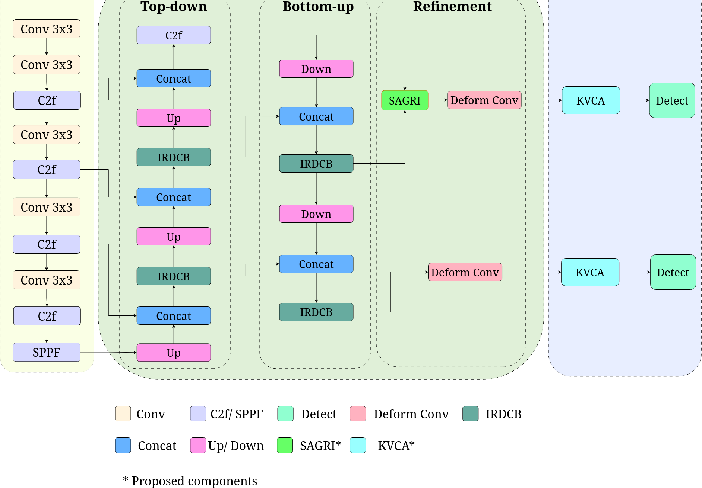
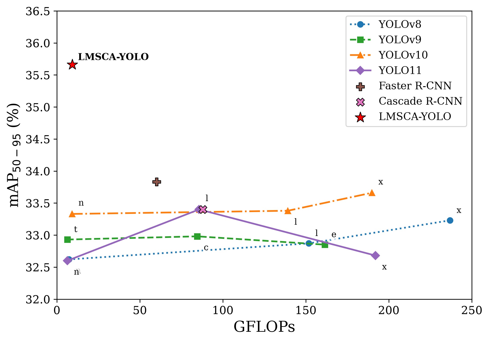

# LMSCA-YOLO

<p align="center">
  <h2 align="center">LMSCA-YOLO: Lightweight Multi-Scale Compressed Attention for Tiny Varroa Mite Detection</h2>
  <p align="center">
    <b>Accepted by EIDT 2026</b>
  </p>
  <p align="center">
    <a href="https://github.com/aduy2408/LMSCA-YOLO">Project Page</a>
    ·
    <a href="#citation">Citation</a>
  </p>
</p>

This repository contains the official implementation of **LMSCA-YOLO**, a lightweight YOLO detector for tiny Varroa mite detection in bee imagery.

## Abstract

Tiny Varroa mites are difficult to detect because repeated downsampling removes fine spatial details, while full self-attention on high-resolution features is expensive. LMSCA-YOLO addresses this trade-off with a lightweight multi-scale feature pyramid, Scale-Aligned Gated Residual Injection (SAGRI), and Key-Value Compressed Attention (KVCA).

SAGRI transfers selected local detail from the high-resolution `P2` feature to the `P3` detection branch without introducing an additional high-resolution detection head. KVCA preserves full-resolution queries while compressing keys and values to reduce attention cost. The final detector uses `P3` and `P4` prediction branches.

## Highlights

- Lightweight multi-scale feature fusion with `IRDCB`.
- High-resolution detail injection with `SAGRI`.
- Efficient key-value contextual modeling with `KVCompressedAttention`.
- Deformable head refinement before prediction.
- Two detection branches at `P3` and `P4`.
- Reported result: `91.27% mAP50`, `35.66% mAP50-95`, `2.23M` parameters, and `9.31 GFLOPs` on the Bee Varroa dataset.

## Method

```text
YOLOv8-style backbone
  -> IRDCB multi-scale feature pyramid
  -> SAGRI(P2, P3)
  -> deformable P3/P4 head convolutions
  -> KVCA on P3/P4
  -> Detect(P3, P4)
```

The reference architecture is defined in:

```text
models_config/yolov8/lmsca/yolov8_lmsca_all.yaml
```

The main components are implemented in:

```text
ultralytics/ultralytics/nn/modules/block.py
ultralytics/ultralytics/nn/modules/__init__.py
ultralytics/ultralytics/nn/tasks.py
```

## Installation

```bash
git clone https://github.com/aduy2408/LMSCA-YOLO.git
cd LMSCA-YOLO

python -m venv .venv
source .venv/bin/activate
pip install -e ./ultralytics
```

Install a PyTorch build appropriate for your CUDA or CPU environment before installing the local package if required by your platform.

## Dataset

Prepare the Bee Varroa dataset in Ultralytics detection format and provide a dataset YAML containing the `train`, `val`, and `test` splits. The dataset is not included in this repository.

Example dataset YAML structure:

```yaml
path: /path/to/bee_varroa
train: images/train
val: images/val
test: images/test
nc: 1
names: [varroa]
```

## Training

Train LMSCA-YOLO with the provided entry point:

```bash
python train_eval/train.py \\
  --data-yaml /path/to/varroa.yaml \\
  --epochs 100 \\
  --imgsz 640 \\
  --batch 4 \\
  --device 0
```

The LMSCA architecture YAML is used by default. To initialize from a compatible checkpoint:

```bash
python train_eval/train.py \\
  --data-yaml /path/to/varroa.yaml \\
  --pretrained /path/to/checkpoint.pt
```

To resume training:

```bash
python train_eval/train.py \\
  --data-yaml /path/to/varroa.yaml \\
  --resume /path/to/last.pt
```

## Evaluation

```bash
python train_eval/eval.py \\
  --weights /path/to/best.pt \\
  --data-yaml /path/to/varroa.yaml \\
  --split test \\
  --device 0
```

## Repository structure

```text
LMSCA-YOLO/
├── models_config/
│   └── yolov8/lmsca/
│       └── yolov8_lmsca_all.yaml
├── train_eval/
│   ├── train.py
│   └── eval.py
├── ultralytics/
│   └── ultralytics/
│       ├── nn/
│       ├── engine/
│       ├── models/
│       └── utils/
└── README.md
```

## Figures

### Architecture



### Efficiency and accuracy comparison



## Citation

If you find this code or method useful, please cite:

```bibtex
@inproceedings{tran2026lmscayolo,
  title     = {LMSCA-YOLO: Lightweight Multi-Scale Compressed Attention for Tiny Varroa Mite Detection},
  author    = {Tran, Ly Minh Hoang and Le, Ngoc-Duy and Hoang, Trung Nguyen and Phan, Thi-Thu-Hong},
  booktitle = {EIDT 2026},
  year      = {2026}
}
```
